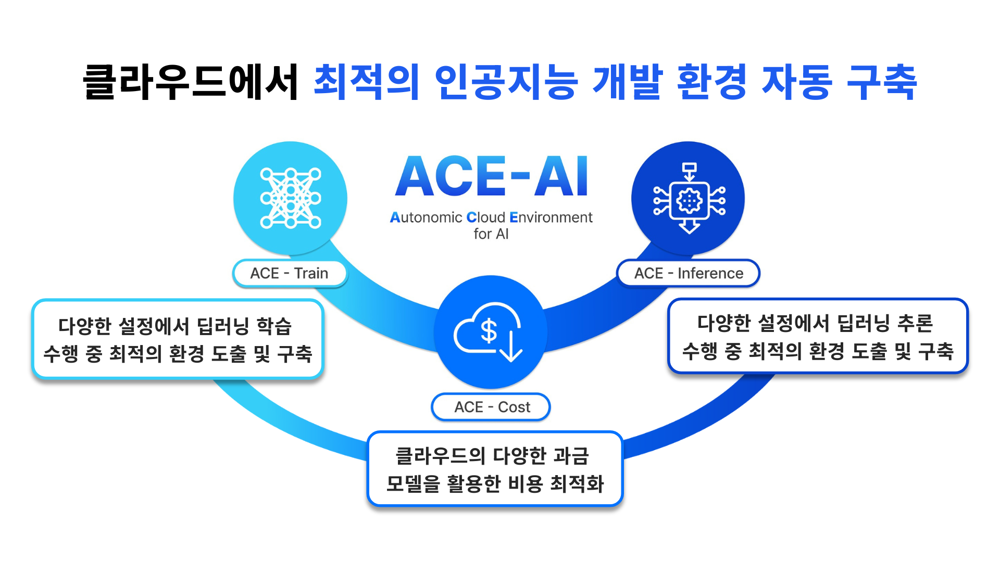

# ACE-AI 성과 대시보드

한양대학교 DDPS Lab에서 수행한 **ACE-AI 국책 과제**의 1단계 성과와 2단계 연구개발 계획을 소개하는 반응형 대시보드입니다.  
프로젝트 헤더, 연구 개발 실적, 공개 SW, 인력 양성, 핵심/미래 모듈 등의 정보를 한눈에 볼 수 있도록 시각화했습니다.



## 주요 특징

- **프로젝트 하이라이트**: 과제 개요, 기관 정보, 로고를 강조한 헤더 애니메이션
- **연구 실적 섹션**: ACE-Train / ACE-Inference / ACE-Cost 논문 및 핵심 기술을 카드 형태로 정리
- **Callisto 통합 서비스**: 비용 효율성, 오픈소스 생태계 등 핵심 지표를 시각적으로 표현
- **공개 SW & 인력 양성**: 카드형 리스트로 성과를 정량/정성적으로 전달
- **미래 계획**: 2단계 연구개발 로드맵 및 모듈별 목표를 모션 카드로 설명
- **전역 스타일**: Tailwind CSS + Pretendard 폰트, Glassmorphism 카드, 모바일 네비게이션 지원

## 기술 스택

| 영역 | 사용 기술 |
| --- | --- |
| 프레임워크 | React 18, TypeScript |
| 스타일 | Tailwind CSS, custom animations, glassmorphism cards |
| 상태/데이터 | Custom hooks (`useSiteData`)로 정적 데이터 주입 |
| 기타 | Framer Motion, Vite Scripts(CRA 기반) |

## 프로젝트 구조

```
src/
├─ app/             # config, hooks, types, utils
├─ components/      # UI 구성 요소 및 섹션 컴포넌트
├─ data/            # 정적 JSON 유사 데이터 모음
├─ pages/           # MainPage
└─ index.tsx        # 엔트리 포인트
```

## 시작하기

### 1. 사전 요구 사항

- Node.js 18+
- npm 9+

### 2. 의존성 설치

```bash
npm install
```

### 3. 개발 서버 실행

```bash
npm start
```

브라우저에서 `http://localhost:3000`을 열면 됩니다. 코드 저장 시 자동으로 리로드됩니다.

### 4. 프로덕션 빌드

```bash
npm run build
```

`build/` 폴더에 최적화된 정적 파일이 생성됩니다.

## 커스텀 데이터 수정

- `src/data/*.ts` 파일에서 성과 데이터 및 모듈 정보를 변경할 수 있습니다.
- 자산 이미지: `public/assets/images` 에 위치하며, `src/app/config/constants.ts`에서 경로를 선언합니다.
